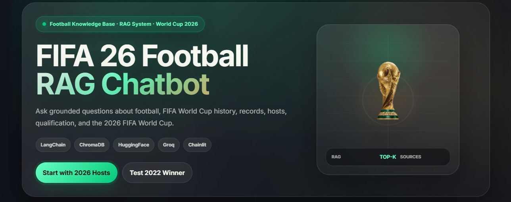
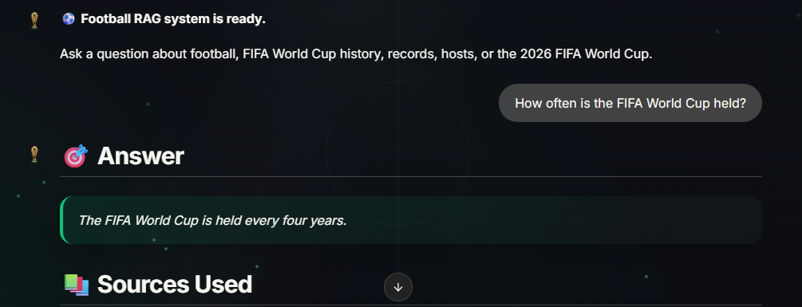
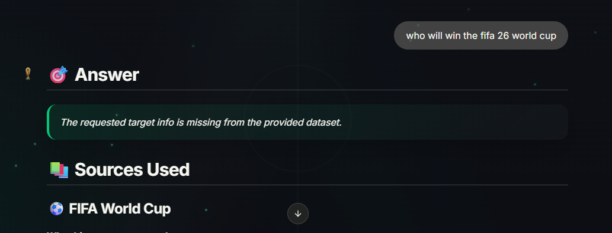

# FIFA 26 Football RAG Chatbot

A premium football-themed Retrieval-Augmented Generation chatbot focused on football, FIFA World Cup history, records, hosts, qualification, and the 2026 FIFA World Cup.

This project uses a local knowledge base created from public Wikipedia articles. It retrieves relevant context from a ChromaDB vector database and generates grounded answers using a Groq LLM through LangChain.

---

## Project Overview

This project demonstrates a complete end-to-end RAG pipeline.

The chatbot does not answer only from the LLM’s internal memory. Instead, it follows a grounded retrieval workflow:

1. Download public football-related Wikipedia articles.
2. Clean and preprocess the text.
3. Split text into token-based chunks.
4. Convert chunks into embeddings.
5. Store embeddings in ChromaDB.
6. Retrieve relevant chunks for each user question.
7. Rerank retrieved chunks for better source quality.
8. Send the best retrieved context to a strict LLM prompt.
9. Display the answer with user-friendly source evidence.

---

## Key Features

- Football and FIFA World Cup knowledge base
- Public Wikipedia dataset
- Reproducible data download script
- Token-based chunking with overlap
- HuggingFace sentence-transformer embeddings
- ChromaDB local vector database
- LangChain-based RAG pipeline
- Groq LLM integration
- Cross-encoder reranking for improved retrieval quality
- Source confidence labels
- Strict prompt for hallucination control
- Chainlit chatbot interface
- Premium football-themed UI
- Custom CSS and JavaScript
- Suggested prompt cards
- Source summaries and evidence previews
- Friendly fallback when information is missing

---

## Tech Stack

| Layer | Technology |
|---|---|
| Language | Python |
| RAG Framework | LangChain |
| Vector Database | ChromaDB |
| Embeddings | HuggingFace `all-MiniLM-L6-v2` |
| Reranker | Cross-encoder reranker |
| LLM Provider | Groq |
| Default LLM | `llama-3.1-8b-instant` |
| UI | Chainlit |
| Styling | Custom CSS |
| UI Enhancement | Custom JavaScript |
| Dataset Source | Wikipedia |

---

## Folder Structure

```text
football-rag-chatbot/
├── architecture/
│   ├── rag_architecture.md
│   └── rag_architecture.png
├── data/
│   ├── *.txt
│   └── sources.json
├── chroma_db/
├── public/
│   ├── styles.css
│   ├── custom.js
│   ├── fifa26-logo.png
│   ├── logo_dark.png
│   └── logo_light.png
├── screenshots/
│   ├── welcome-ui.png
│   ├── answer-with-sources.png
│   ├── hallucination-test.png
├── tests/
│   └── test_questions.md
├── .chainlit/
│   └── config.toml
├── app.py
├── download_data.py
├── ingest.py
├── rag_chain.py
├── requirements.txt
├── .gitignore
├── engineering_report.md
└── README.md
```

---

## Architecture

```text
Wikipedia Articles
        ↓
download_data.py
        ↓
data/*.txt + data/sources.json
        ↓
ingest.py
        ↓
Text Cleaning + Token Chunking
        ↓
HuggingFace Embeddings
        ↓
ChromaDB Vector Database
        ↓
rag_chain.py
        ↓
Top-k Candidate Retrieval
        ↓
Cross-encoder Reranking
        ↓
Best Context Chunks
        ↓
Strict Prompt + Groq LLM
        ↓
Chainlit Chat UI
        ↓
Answer + Source Evidence
```

---

## Architecture Diagram

The complete RAG workflow is documented here:

```text
architecture/rag_architecture.md
```

If available, the exported architecture image is available here:

```text
architecture/rag_architecture.png
```

The architecture covers:

- Wikipedia data collection
- Source metadata storage
- Text cleaning
- Token chunking
- Embedding generation
- ChromaDB vector storage
- Candidate retrieval
- Reranking
- Strict grounded prompting
- Groq LLM response generation
- Chainlit UI answer and source display

---

## Screenshots

### Welcome UI



### Answer with Source Evidence



### Hallucination Control Test



### Processing State


---

## Dataset

The dataset is created from publicly available Wikipedia articles.

Selected articles include:

- Association football
- FIFA World Cup
- History of the FIFA World Cup
- 2026 FIFA World Cup
- 2022 FIFA World Cup
- FIFA World Cup records and statistics
- List of FIFA World Cup finals
- List of FIFA World Cup hosts
- FIFA World Cup qualification

The dataset files are saved inside:

```text
data/
```

Source metadata is saved in:

```text
data/sources.json
```

The metadata includes:

- Article title
- File name
- Source URL
- Page ID
- Retrieval timestamp
- License information
- Character count

---

## RAG Pipeline

The RAG pipeline is handled mainly by:

```text
rag_chain.py
```

The process is:

1. User asks a question in Chainlit.
2. The question is sent to `ask_rag()`.
3. ChromaDB retrieves candidate chunks.
4. The reranker improves chunk ordering.
5. The best chunks are formatted into context.
6. A strict prompt sends the question and context to the LLM.
7. The LLM generates a grounded answer.
8. Source summaries and evidence previews are shown in the UI.

---

## Reranking

The project includes a reranking step to improve retrieval quality.

Instead of directly sending the first retrieved chunks to the LLM, the system retrieves more candidate chunks first and then reranks them.

```text
ChromaDB top 10 candidates
        ↓
Cross-encoder reranker
        ↓
Best top 4 chunks
        ↓
Strict RAG prompt
```

This helps the chatbot use more relevant context and improves the quality of source evidence.

---

## Source Confidence

The system also displays a user-friendly source confidence label.

| Confidence | Meaning |
|---|---|
| High | The retrieved source is strongly related to the question |
| Medium | The retrieved source is somewhat related |
| Low | The retrieved source may only be loosely related |

The raw retrieval score is kept internal, while the UI shows a clean confidence label for users.

---

## Hallucination Control

The chatbot is designed to avoid unsupported claims.

If information is not present in the retrieved context, the chatbot should reply:

```text
The requested target info is missing from the provided dataset.
```

Example test question:

```text
Who will win the 2026 FIFA World Cup?
```

Expected response:

```text
The requested target info is missing from the provided dataset.
```

This prevents the model from guessing future results.

---

## Source Evidence

Each answer includes source evidence from retrieved chunks.

The UI displays sources in a user-friendly way:

- Source title
- Source confidence
- Short explanation of why the source was used
- Source link
- Evidence preview

Technical details like chunk IDs and total chunk counts are hidden from normal users to keep the interface clean.

---

## Setup Instructions

### 1. Clone the Repository

```bash
git clone <your-repository-url>
cd football-rag-chatbot
```

---

### 2. Create a Virtual Environment

For Windows PowerShell:

```powershell
python -m venv venv
.\venv\Scripts\Activate.ps1
```

If PowerShell blocks activation, run:

```powershell
Set-ExecutionPolicy -Scope Process -ExecutionPolicy Bypass
.\venv\Scripts\Activate.ps1
```

For macOS/Linux:

```bash
python -m venv venv
source venv/bin/activate
```

---

### 3. Install Dependencies

```bash
pip install -r requirements.txt
```

---

### 4. Create `.env` File

Create a `.env` file in the project root.

```env
GROQ_API_KEY=your_groq_api_key_here
GROQ_MODEL=llama-3.1-8b-instant
HF_TOKEN=your_optional_huggingface_token_here
```

`HF_TOKEN` is optional, but it can help avoid unauthenticated HuggingFace Hub warnings.

Do not commit your real `.env` file to GitHub.

---

### 5. Download Dataset

```bash
python download_data.py
```

This creates:

```text
data/*.txt
data/sources.json
```

---

### 6. Build Vector Database

```bash
python ingest.py
```

This creates:

```text
chroma_db/
```

---

### 7. Run the Chainlit App

```bash
chainlit run app.py
```

Open the browser at:

```text
http://localhost:8000
```

---

## Example Questions

Try these questions in the chatbot:

```text
Which countries are hosting the 2026 FIFA World Cup?
```

```text
Who won the 2022 FIFA World Cup?
```

```text
What is association football?
```

```text
How often is the FIFA World Cup held?
```

```text
What are some FIFA World Cup records?
```

---

## Testing

Manual test questions are available in:

```text
tests/test_questions.md
```

The test file includes:

- Answerable questions
- Retrieval quality questions
- Hallucination control questions
- Unrelated questions
- Edge case questions
- Manual evaluation checklist

Run the app and test the questions one by one.

---

## UI Customization

The premium football-themed UI is handled by:

```text
public/styles.css
public/custom.js
```

The UI includes:

- Football field-inspired background
- Stadium lighting effects
- Animated floating particles
- Premium landing hero
- Prompt cards
- Football-themed send and stop buttons
- Dark mode styling
- User-friendly source display
- Auto-scroll behavior focused on the answer

Chainlit loads these files through:

```text
.chainlit/config.toml
```

Important config lines:

```toml
[UI]
custom_css = "/public/styles.css"
custom_js = "/public/custom.js"
default_theme = "dark"
layout = "wide"
```

---

## Important Files

### `download_data.py`

Downloads selected Wikipedia articles and stores them as plain text files with metadata.

### `ingest.py`

Loads text files, cleans the content, splits it into chunks, creates embeddings, and stores everything in ChromaDB.

### `rag_chain.py`

Loads the vector database, retrieves relevant candidate chunks, reranks them, formats context, calls the Groq LLM, and returns the final answer with sources.

### `app.py`

Runs the Chainlit chatbot interface and connects the UI with the RAG pipeline.

### `public/styles.css`

Contains the premium football-themed UI styling.

### `public/custom.js`

Injects the custom football landing hero, interactive prompt cards, and answer-focused scrolling behavior into Chainlit.

### `tests/test_questions.md`

Contains manual evaluation questions for accuracy, retrieval, hallucination control, and edge cases.

### `engineering_report.md`

Explains the project architecture, dataset, chunking, embeddings, vector database, retrieval strategy, reranking, prompt design, limitations, and future improvements.

---

## Rebuild Instructions

If you update the dataset or change chunking settings, rebuild the vector database:

```bash
python ingest.py
```

Then restart the app:

```bash
chainlit run app.py
```

---

## GitHub Notes

Make sure these files/folders are not committed:

```text
.env
venv/
__pycache__/
chroma_db/
```

Recommended `.gitignore`:

```gitignore
venv/
.env
__pycache__/
*.pyc
chroma_db/
.chainlit/*
!.chainlit/config.toml
```

Keep this file committed:

```text
.chainlit/config.toml
```

Because it contains the UI configuration for the project.

---

## Limitations

- The knowledge base is limited to selected Wikipedia articles.
- The chatbot cannot answer questions outside the dataset.
- The chatbot does not automatically update its dataset unless `download_data.py` is run again.
- Retrieval quality depends on the quality of stored chunks.
- Reranking improves source quality but may increase response time slightly.
- The UI logo transparency depends on the actual image file having a transparent background.

---

## Future Improvements

- Add automated evaluation script.
- Add model comparison between Groq models.
- Add hybrid search using keyword search plus vector search.
- Add more football datasets.
- Add Docker support.
- Add deployment guide.
- Add screenshots and demo GIF.
- Improve final logo transparency and branding.
- Add admin option to rebuild the vector database from UI.

---

## Conclusion

The FIFA 26 Football RAG Chatbot is a complete RAG-based AI project with a football-focused knowledge base, strict grounded prompting, source transparency, reranking, and a premium Chainlit interface.

It demonstrates practical skills in:

- Data collection
- Text preprocessing
- Embeddings
- Vector databases
- Retrieval-Augmented Generation
- Reranking
- Prompt engineering
- UI customization
- Hallucination control
- Project documentation

